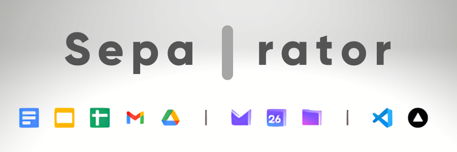
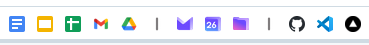
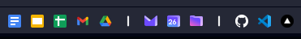

<h1 align="center">
  
</h1>

**Separator** is a simple, easy-to-use separator for your bookmarks bar

> **⚠️ IMPORTANT:** Separator uses 2 icons (Light or dark) dependent on the system theme. These may interfere with some themes, such as if the browser is using a theme that appears light, while the system is set to dark mode.

## 📄 Examples
 

> Screenshots taken using Opera browser
## ✅ Usage
<b>⭐ Get the bookmark: </b> [Click here to go to the website.](https://itsfoxdev.github.io/separator)

## 🗺️ Roadmap
*🕸️ Nothing here yet...*

`🔴` = Not started‎‎ ‎ ‎ ‎ ‎ `🟡` = In development‎ ‎ ‎ ‎ ‎ `🟢` = Implemented

## ℹ️ Information
Commit icon guide:
- `⬆️` = Uploaded a file
- `🎉` = Major update
- `🐛` = Bug fix
- `🚧` = Test update
- `🏷️` = Text/label edit
- `🗑️` = File removed

## 📦 How to contribute
1. Fork the repository
2. Make changes in the fork
3. Create a pull request
4. Your pull request will be reviewed
